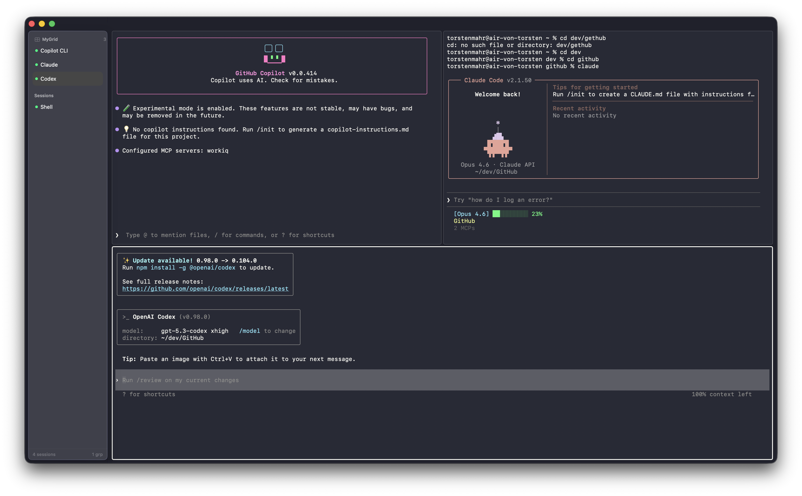

<div align="center">

# HiveTerm

**A native macOS terminal for AI agent workflows.**

Run Claude Code, Copilot CLI, and other agents side-by-side — with instant switching, input detection, and zero electron overhead.

[](https://www.apple.com/macos/)
[](https://swift.org)
[](https://github.com/migueldeicaza/SwiftTerm)

</div>

---



---

## The Problem

You're running 4 Claude Code agents across different repos. One is waiting for a `sudo` password. Another finished and needs review. Your terminal has 12 tabs and you're `Cmd+Tab`-ing between windows trying to figure out which agent needs attention.

**HiveTerm fixes this.** Every session shows its status at a glance. Sessions waiting for input get highlighted. Group related sessions into a grid and see them all at once.

## Features

**Multi-session grid layout** — Group sessions into side-by-side or 2x2 grids. Each group gets its own layout. Ungrouped sessions display fullscreen.

**Input detection** — Automatically detects when a session is waiting for user input (password prompts, confirmation dialogs, interactive commands) and highlights it in the sidebar.

**Instant switching** — All terminals stay alive in a single AppKit container. Switching sessions toggles `isHidden` — no view teardown, no lag.

**Native performance** — Built with Swift, SwiftUI, and AppKit. Uses [SwiftTerm](https://github.com/migueldeicaza/SwiftTerm) for terminal emulation with full PTY support. No web views, no Electron.

**Session grouping** — Drag sessions onto each other in the sidebar to create groups. Reorder within groups via context menu or drag & drop.

## Keyboard Shortcuts

| Action | Shortcut |
|:---|:---|
| New session | `Cmd + T` |
| Close session | `Cmd + W` |
| Switch to session 1–9 | `Cmd + 1` — `Cmd + 9` |
| Rename session | `Cmd + R` |
| Debug overlay | `Cmd + Shift + D` |

## Architecture

```
HiveTerm.app
├── SwiftUI              Sidebar, toolbar, window chrome
├── AppKit               TerminalHostView — single NSView managing all terminals
├── SwiftTerm (SPM)      Terminal emulation, PTY I/O
└── InputDetector        Pattern matching + process state analysis
```

The key architectural decision: a single `TerminalHostView` (NSView) owns all terminal views as subviews. SwiftUI controls state, but the terminal lifecycle is pure AppKit — no `NSViewRepresentable` teardown/rebuild on session switch.

```
┌──────────┬──────────────────────────────────────┐
│ Sidebar  │  TerminalHostView                    │
│          │  ┌────────────┬─────────────────┐    │
│ ● Claude │  │            │                 │    │
│   Code   │  │  Session 1 │  Session 2      │    │
│          │  │  (visible) │  (visible)      │    │
│ ● Copilot│  ├────────────┴─────────────────┤    │
│   CLI    │  │                              │    │
│          │  │  Session 3 (visible)         │    │
│ ○ Tests  │  │                              │    │
│   idle   │  └──────────────────────────────┘    │
├──────────┴──────────────────────────────────────┤
│  3 sessions · 1 waiting                         │
└─────────────────────────────────────────────────┘
```

## Getting Started

**Requirements:** Xcode 15+ · macOS 14 Sonoma

```bash
git clone https://github.com/trsdn/HiveTerm.git && cd HiveTerm
xcodebuild -scheme HiveTerm -configuration Release build
cp -R build/Release/HiveTerm.app /Applications/
```

Since HiveTerm is not notarized, remove the quarantine attribute before first launch:

```bash
xattr -cr /Applications/HiveTerm.app
```

## Roadmap

- [ ] Tab colors / custom labels per session
- [x] Ghostty/iTerm2 color scheme import
- [ ] Split pane resizing via drag
- [ ] Session persistence across app restarts
- [ ] Notification when a waiting session gets input

## License

MIT
